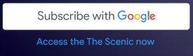

<!---
Copyright 2018 The Subscribe with Google Authors. All Rights Reserved.

Licensed under the Apache License, Version 2.0 (the "License");
you may not use this file except in compliance with the License.
You may obtain a copy of the License at

     http://www.apache.org/licenses/LICENSE-2.0

Unless required by applicable law or agreed to in writing, software
distributed under the License is distributed on an "AS-IS" BASIS,
WITHOUT WARRANTIES OR CONDITIONS OF ANY KIND, either express or implied.
See the License for the specific language governing permissions and
limitations under the License.
-->

# SwG buttons

The [Subscriptions service](../src/api/subscriptions.js) provides two button APIs:
 - `createButton`
 - `attachButton`

It's also possible to create a SwG button manually.

## APIs

Both APIs are very similar - the only difference is the `createButton` creates a new DOM element, while the `attachButton` decorates an existing one.

Both APIs require a callback and accept an optional `options` object. The configurable options are:

 - `lang`: Sets the button SVG and title.  English is default language.  See [Button API](../src/runtime/button-api.js) for `lang` values.
 - `theme`: Button theme can be `light` (default) or `dark`.

The API call without options:

```js
subscriptions.createButton(function() {
  // Handle the action.
});
```

The API call with options:

```js
subscriptions.createButton({theme: 'dark', lang:'pt-br'}, function() {
  // Handle the action.
});
```

## Manual button styling

The SwG button styles are available in the SwG stylesheet:

```html
<link rel="stylesheet" href="https://news.google.com/swg/js/v1/swg-button.css">
```

Note that this stylesheet is installed by `swg.js` automatically.

Using this stylesheet, it's easy to decorate a button as a SwG button using `swg-button`, `swg-button-light`, and `swg-button-dark` classes.

For instance:

```html
<button class="swg-button-light"></button>
```

#

## Smart Button*

***NOTE: This feature is a Work-In-Progress and might change.**

`SmartButton` renders the button with a contextual message underneath the button.
To attach a smart button, call the `attachSmartButton` API by passing the existing
button element available in the page to render the `SmartButton` within.


```js
subscriptions.attachSmartButton(
  buttonElement,
  {theme: 'light', lang: 'en'},
  function() {
      // Callback to attach the action on button click event.
      // i.e. To Launch Offers flow:
      // subscriptions.showOffers({isClosable: true});
});
```

   OR

```js
subscriptions.attachSmartButton(
  buttonElement,
  function() {
      // Callback to attach the action on button click event.
      // i.e. To Launch Offers flow:
      // subscriptions.showOffers({isClosable: true});
});
```

### Parameters:

- `buttonElement` (Required): HTML button element where smartButton is rendered.
- `options` (Optional): Configures appearance of button.
  - `lang`: (Optional) Sets the button SVG and title.  English is default language.  See [Button API](../src/runtime/button-api.js) for `lang` values.
  - `theme`: (Optional) Button theme can be `light` (default) or `dark`.
  - `messageTextColor`: (Optional) Sets color for message shown below button (Ex: "Subscribe in 2 minutes..."). Can be any color. Defaults to `"#757575"`. The following formats are supported:
    - color names (i.e. red or blue)
    - hex colors (i.e. #fff or #ffffff)
    - rgb(r, g, b)
    - rgba(r, g, b, a)
- `callback` (Required): Callback to provide action on click of `button`.


### Button container sizing:
The `SmartButton` is rendered with following CSS specifications to render
`button` and the `message` within:

```css
  min-height: 126px;
  min-width: 300px;
  width: 300px;
  background: transparent;

```


User can specify `width` and `height` to be higher than `min-width` and `min-height`
CSS properties to align within the existing layout/style.

For instance:

```html

<button style="width: 500px; height: 200px;"></button>

```


# Sample buttons:

`Button` with `light` theme:


`Button` with `dark` theme:


`SmartButton` with `light` theme:


`SmartButton` with `dark` theme:


`SmartButton` with custom messageTextColor:



