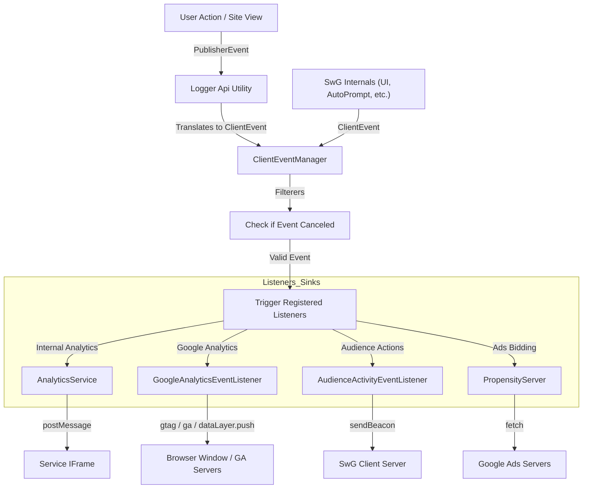

<!--- 
Copyright 2026 The Subscribe with Google Authors. All Rights Reserved.

Licensed under the Apache License, Version 2.0 (the "License");
you may not use this file except in compliance with the License.
You may obtain a copy of the License at

     http://www.apache.org/licenses/LICENSE-2.0

Unless required by applicable law or agreed to in writing, software
distributed under the License is distributed on an "AS-IS" BASIS,
WITHOUT WARRANTIES OR CONDITIONS OF ANY KIND, either express or implied.
See the License for the specific language governing permissions and
limitations under the License.
-->
# Event and Telemetry Logging in swg-js

This document describes how event and telemetry logging works in the Subscribe with Google (`swg-js`) library. It focuses on the **Lifecycle of an Event**, the **Central Event Manager**, and how **Listeners** process events for analytics, tracking, and ads bidding.

---

## 1. High-Level Architecture

The logging system is based on a **Publisher-Subscriber** pattern where events are validated and broadcast to registered listeners.

### Key Components

- **`ClientEventManager`** (`src/runtime/client-event-manager.ts`): The central clearinghouse for events.
- **`Logger`** (`src/runtime/logger.ts`): Implements `LoggerApi` (`src/api/logger-api.ts`) and provides a high-level API for publishers to send user events.
- **Listeners**: Modules that subscribe to `ClientEventManager` to process events for specific destinations (Analytics, GA, etc.).

---

## 2. Event Lifecycle & Data Flow

Here is how an event flows from creation to its final destination:



---

## 3. Publisher Visibility & Parameter Mapping

Publishers use the high-level `LoggerApi` to report events (such as "Impression Paywall" or "Offer Selected").

### Mapping `AnalyticsEvent` to Semantic Concepts

The file `src/runtime/event-type-mapping.ts` is the central mapping utility for standard analytics events. It translates internal `AnalyticsEvent` enums into external representations.

#### Common Parameter Mappings

- **`cta_mode`**: Maps the internal `CtaMode` enum (pop-up vs inline) to strings displayed in analytics dashboard. (Note: This specific string mapping is implemented in `src/runtime/google-analytics-event-listener.ts`).
- **`subscription_flow`**: Differentiates between `subscribe` vs `contribute` flows.

---

## 4. Detailed Listener Behaviors

Each listener registers itself with the `ClientEventManager` to receive events and process them according to its specific use case.

### 4.1. Internal Analytics Service (`AnalyticsService`)
**Purpose**: Primary sink for SwG internal analytics.
- **Behavior**:
  - Buffers events until the system is "ready."
  - Forwards events to a hidden service iframe via `ActivityPorts.openIframe`.
  - Implements retry/timeout logic to ensure data is sent before page redirects.
- **Captured Events**: Captures **all events** EXCEPT `EVENT_SUBSCRIPTION_STATE` and those originating from `SHOWCASE_CLIENT`.
- **Output Format**: Array of Mixed data (proto-array positional serialization) sent over `postMessage` to the service Iframe.


### 4.2. Google Analytics Listener (`GoogleAnalyticsEventListener`)
**Purpose**: Forwards events to standard GA, GA4 (gtag), or Google Tag Manager (GTM).
- **Eligibility**: Requires `window.ga`, `window.gtag`, or `window.dataLayer` to be present.
- **Behavior**:
  - Automatically maps `AnalyticsEvent` to standard Event Category/Action/Label (e.g., `NTG paywall` / `paywall modal impression`).
- **Output Format**: Direct JavaScript function calls passing arguments (objects/maps). It does not serialize to a text payload in `swg-js`.

#### JavaScript Schema by Tag Type

Depending on the tag loaded on the page, the Schema varies:

**1. GA4 (`window.gtag`)**
```json
{
  "event_category": "string",
  "event_label": "string",
  "non_interaction": "boolean",
  "cta_mode": "string", // e.g., 'pop up', 'inline'
  // ... any custom dimensions from ClientEventParams
}
```

**2. Legacy Universal Analytics (`window.ga`)**
```json
{
  "eventCategory": "string",
  "eventAction": "string",
  "eventLabel": "string",
  "nonInteraction": "boolean"
}
```

**3. Google Tag Manager (`window.dataLayer`)**
```json
{
  "event": "string", // The event action name
  "event_category": "string",
  "event_label": "string",
  "non_interaction": "boolean",
  "configurationId": "string",
  "cta_mode": "string",
  // ... any custom dimensions from ClientEventParams
}
```

#### Captured Events (Subset)

| Event Type | Category (Default) | Action (Default) | NonInteraction |
| :--- | :--- | :--- | :---: |
| `IMPRESSION_OFFERS` | `NTG paywall` | `paywall modal impression` | Yes |
| `IMPRESSION_CONTRIBUTION_OFFERS` | `NTG membership` | `offer impressions` | Yes |
| `ACTION_OFFER_SELECTED` | `NTG paywall` | `click` | No |
| `ACTION_SWG_SUBSCRIPTION_MINI_PROMPT_CLICK` | `NTG subscription` | `marketing modal click` | No |
| `IMPRESSION_SWG_SUBSCRIPTION_MINI_PROMPT` | `NTG subscription` | `marketing modal impression` | Yes |
| `ACTION_SWG_CONTRIBUTION_MINI_PROMPT_CLICK` | `NTG membership` | `marketing modal click` | No |
| `IMPRESSION_SWG_CONTRIBUTION_MINI_PROMPT` | `NTG membership` | `membership modal impression` | Yes |
| `IMPRESSION_NEWSLETTER_OPT_IN` | `NTG newsletter` | `newsletter modal impression` | Yes |
| `EVENT_NEWSLETTER_OPTED_IN` | `NTG newsletter` | `newsletter signup` | No |
| `IMPRESSION_BYOP_NEWSLETTER_OPT_IN` | `NTG newsletter` | `newsletter modal impression` | Yes |
| `ACTION_BYOP_NEWSLETTER_OPT_IN_SUBMIT` | `NTG newsletter` | `newsletter signup` | No |
| `IMPRESSION_REGWALL_OPT_IN` | `NTG account` | `registration modal impression` | Yes |
| `EVENT_REGWALL_OPTED_IN` | `NTG account` | `registration` | No |
| `ACTION_SURVEY_DATA_TRANSFER` | | `survey submission` | No |
| `IMPRESSION_BYO_CTA` | | `custom cta modal impression` | Yes |
| `ACTION_BYO_CTA_BUTTON_CLICK` | | `custom cta click` | No |
| `ACTION_PAYMENT_COMPLETE` | `NTG subscription` / `NTG membership` | `submit` success | No |

#### Special Case: Survey Data Transfer Schema

When a user submits a survey, `swg-js` captures responses and pushes them to GA with a enriched schema. This is handled by `handleSurveyDataTransferRequest` in `src/utils/survey-utils.ts`.

For each answer submitted, it pushes an event `ACTION_SURVEY_DATA_TRANSFER` with the following parameters:

```json
{
  "event": "survey submission",
  "event_category": "string", // Question Category
  "event_label": "string", // Answer Text
  "survey_question": "string", // Question Text
  "survey_question_category": "string", // Question Category
  "survey_answer": "string", // Answer Text
  "survey_answer_category": "string", // Answer Category
  "content_id": "string", // Question Category (GA4 Default)
  "content_group": "string", // Question Text (GA4 Default)
  "content_type": "string" // Answer Text (GA4 Default)
}
```

This dense schema ensures publishers can analyze survey results natively using standard content reports or custom dimensions.


### 4.3. Audience Activity Listener (`AudienceActivityEventListener`)
**Purpose**: Forwards audience actions (clicks, impressions) to SwG Client Server.
- **Behavior**:
  - Filters for specific audience events (e.g., `ACTION_NEWSLETTER_OPT_IN_BUTTON_CLICK`).
  - Sends requests using `navigator.sendBeacon` to `/publication/{pubId}/audienceactivity`.
  - Requires valid user authentication token.
- **Output Format**: JSON-serialized `AudienceActivityClientLogsRequest` sent over `navigator.sendBeacon`.

#### Captured Events (Subset)

| Type | Event Name |
| :--- | :--- |
| **Impressions** | `IMPRESSION_OFFERS`, `IMPRESSION_CONTRIBUTION_OFFERS`, `IMPRESSION_PAGE_LOAD`, `IMPRESSION_PAYWALL`, `IMPRESSION_REGWALL_OPT_IN`, `IMPRESSION_NEWSLETTER_OPT_IN`, `IMPRESSION_SURVEY`, `IMPRESSION_BYO_CTA` |
| **Actions** | `ACTION_PAYMENT_FLOW_STARTED`, `ACTION_PAYMENT_COMPLETE`, `ACTION_CONTRIBUTION_OFFER_SELECTED`, `ACTION_REGWALL_OPT_IN_BUTTON_CLICK`, `ACTION_REGWALL_ALREADY_OPTED_IN_CLICK`, `ACTION_NEWSLETTER_OPT_IN_BUTTON_CLICK`, `ACTION_NEWSLETTER_ALREADY_OPTED_IN_CLICK`, `ACTION_SURVEY_SUBMIT_CLICK`, `ACTION_SURVEY_NEXT_BUTTON_CLICK`, `ACTION_SURVEY_PREVIOUS_BUTTON_CLICK`, `ACTION_SURVEY_CLOSED`, `ACTION_BYO_CTA_BUTTON_CLICK`, `ACTION_BYO_CTA_CLOSE` |


### 4.4. Propensity Server (`PropensityServer`)
**Purpose**: Forwards events for ads scoring.
- **Behavior**:
  - Checks if `enablePropensity` is configured.
  - Translates events for ads bids endpoints using `analyticsEventToPublisherEvent`.
  - Appends contextual cookies for processing.
- **Output Format**: HTTP Query Parameters (`events={publicationId}:{eventName}`) sent via Fetch.

#### Captured Events (Subset)

| Event Name |
| :--- |
| `IMPRESSION_PAYWALL` |
| `IMPRESSION_AD` |
| `IMPRESSION_OFFERS` |
| `ACTION_SUBSCRIPTIONS_LANDING_PAGE` |
| `ACTION_OFFER_SELECTED` |
| `ACTION_PAYMENT_FLOW_STARTED` |
| `ACTION_PAYMENT_COMPLETE` |
| `EVENT_CUSTOM` |


---

## 5. Event Parameters

Events carry both standard fields and optional context-specific parameters.

### 5.1. Standard `ClientEvent` Fields (All Events)

| Field | Description | Type / Example |
| :--- | :--- | :--- |
| `eventType` | The type of event that occurred | `AnalyticsEvent` enum |
| `eventOriginator` | Who initiated the event | `EventOriginator` enum |
| `isFromUserAction` | True if user took an action to generate it | `boolean` |
| `timestamp` | When the event happened | epoch ms |
| `configurationId` | Optional ID of the associated action config | `string` |
| `additionalParameters` | JSON object for generic extra data | `object` |

### 5.2. `ClientEventParams` (Passed to logEvent)

| Field | Description | Type / Example |
| :--- | :--- | :--- |
| `googleAnalyticsParameters` | Overrides standard GA fields for testing or manual triggers | `GoogleAnalyticsParameters` |
| - `event_category` | GA event category | `string` |
| - `event_label` | GA event label | `string` |
| - `survey_question` | Question text if survey | `string` |
| - `survey_answer_category` | Answer category if survey | `string` |
| - `cta_mode` | Pop-up vs inline | `string` |

### 5.3. `EventParams` (Internal Proto Data)

| Field | Description | Type / Example |
| :--- | :--- | :--- |
| `sku` | SKU associated with the offer | `string` |
| `subscriptionFlow` | Subscribe vs Contribute | `string` |
| `ctaMode` | Pop-up vs inline | `CtaMode` enum |
| `campaignId` | ID of the marketing campaign | `string` |
| `isUserRegistered` | User has a registered account | `boolean` |
| `oldTransactionId` | ID of previous transaction | `string` |
| `gpayTransactionId` | ID of Google Pay transaction | `string` |
| `optInType` | Opt-in type (newsletter/regwall) | `OptInType` enum |
| `emailValidationStatus` | Email syntax status | `EmailValidationStatus` enum |
| `gisMode` | GIS display mode | `GisMode` enum |
| `linkedPublicationsCount` | Count of linked pubs | `number` |

### 5.4. Global Context (`AnalyticsContext`)

| Field | Description | Type / Example |
| :--- | :--- | :--- |
| `url` | Page URL | `string` |
| `referringOrigin` | Referrer URL | `string` |
| `utmSource` / `utmCampaign` / `utmMedium` | Marketing campaign tracking | `string` |
| `clientVersion` | Library version | `string` |
| `isLockedContent` | Is the article locked | `boolean` |
| `transactionId` | Unique action sequence tracking ID | `string` |


