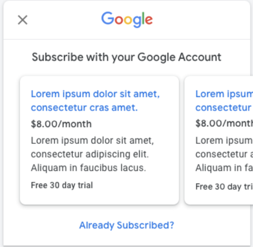
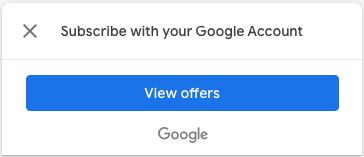
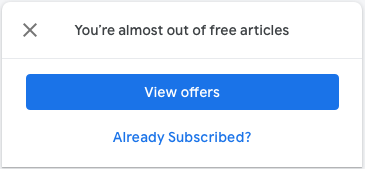

<!---
Copyright 2018 The Subscribe with Google Authors. All Rights Reserved.

Licensed under the Apache License, Version 2.0 (the "License");
you may not use this file except in compliance with the License.
You may obtain a copy of the License at

     http://www.apache.org/licenses/LICENSE-2.0

Unless required by applicable law or agreed to in writing, software
distributed under the License is distributed on an "AS-IS" BASIS,
WITHOUT WARRANTIES OR CONDITIONS OF ANY KIND, either express or implied.
See the License for the specific language governing permissions and
limitations under the License.
-->

# SwG Offers Flow

This flow allows the publication site to display numerous flows to purchase the subscription. See [Subscriptions APIs](./core-apis.md).

The offers flow will first present a set of offers known to SwG. A user will get a choice to either select one of the offers, or try request login to claim an existing subscription.

To display offers:

```js
subscriptions.showOffers();
```


If a user elects for a presented offer, SwG will run the [Subscribe flow](./subscribe-flow.md).

To handle the login request:

```js
subscriptions.setOnLoginRequest(function() {
  // Handle login request.
});
```


### Native option in offers

There's a mode when showing SwG Offers that will give the user an option to see more offers on the publisher's side. To enable this option, you simply need to declare the `setOnNativeSubscribeRequest` callback:

```js
subscriptions.setOnNativeSubscribeRequest(function() {
  // Proceed to the publisher's own offers UX.
});
```


## SwG Subscribe Option

A small variation of `subscriptions.showOffers` is the `subscriptions.showSubscribeOption` API. This presents a non-blocking abbreviated option to user to use SwG.

To activate:

```js
subscriptions.showSubscribeOption();
```


## SwG Abbreviated Offer

Another small variation of `subscriptions.showOffers` is the `subscriptions.showAbbrvOffer` API. This presents a non-blocking abbreviated option to user to select offers or to proceed to login/account linking.

To activate:

```js
subscriptions.showAbbrvOffer();
```



## Offer options

All offers APIs (`showOffers`, `showSubscribeOption`, and `showAbbrvOffer`) accept the following options:

- `skus`: List of SKUs to display in the carousel. Required for upgrade/downgrade flows.
- `list`: A predefined list of SKUs. Use of this property is uncommon. Possible values are "default" and "amp". Default is "default".
- `isClosable`: A boolean value to determine whether the view is closable.
- `oldSku`: Only applicable for upgrade/downgrade flows. This is the SKU to replace for the user.

For instance:

```js
subscriptions.showOffers({skus: ['sku1', 'sku2']});
```

Upgrade (or downgrade) example:

```js
subscriptions.showOffers({skus: ['replacementSku1', 'replacementSku2'], oldSku: 'existingSkuToReplace'});

*Important!* Please ensure you set up the `setOnPaymentResponse` on any page where you accept purchases, not just before you call `subscribe` or `showOffers`. SwG client ensures it can recover subscriptions even when browsers unload pages. See [Subscribe flow](./subscribe-flow.md) for more details.
